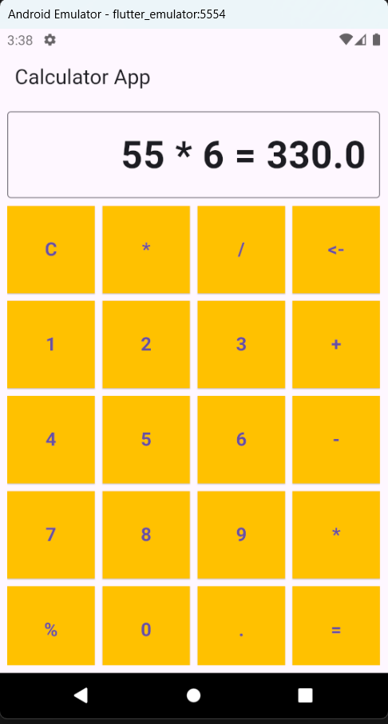

# Calculator App Project

## GitHub Repository Link
[GitHub Repository](https://github.com/SantoshKcy/Calculator_application.git)


## Output Example

### Example 1: 4 + 4
Here is a screenshot showing the output when you input `4 + 4`:



**Input**: `55 * 6`  
**Output**: `55 * 6 = 330.0`


## How to Run the Project
1. Clone the repository:

   ```bash
   git clone https://github.com/SantoshKcy/Calculator_application.git